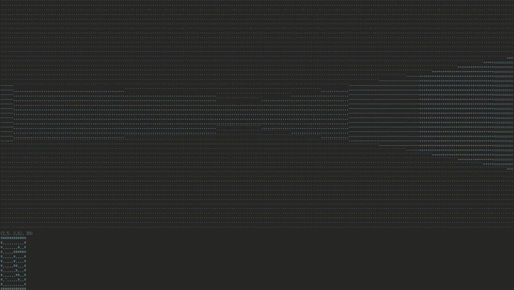

# Raycasting in c++

## Result




## Compilation

Code doesn't need any extra flags, using g++:

```sh
g++ main.cpp
```

Then just run executable. It probably works only with UNIX.

## Parameters

Parameters variables you can change starts in line 12.  
`MAP_WIDTH` and `MAP_HEIGHT` have to fit to size of board you created.  
`SCREEN_WIDTH` and `SCREEN_HEIGHT` are sizes of board on terminal. Both should be even numbers :)  
`posX` and `posY` are starting coordinates of player. The coordinate system starts in left bottom corner of board with.  
`direction` is angle of direction of player in degrees relative.  
`FOV` is an field of view of player in degrees.  
`MOVEMENT_SPEED` is step player will do every key press.  
`ROTATION_SPEED` is step in degrees player will rotate every key press.  
`charset` is set of colors used to drawing walls (from closer to farther). There are some example sets in comment underneath. `COLORS` has to be set on size of charset.  
`ceil_color` and `floor_color` are characters of ceil and floor respectively.  
Generally smaller fonts looks better. Diffrent fonts and terminal backgrounds need diffrent charsets to look good.  

## Controls

To move player press and/or hold keys:  
`w` -  go forward  
`s` -  go back  
`d` -  go right  
`a` -  go left  
`l` - rotate right  
`k` - rotate left  
